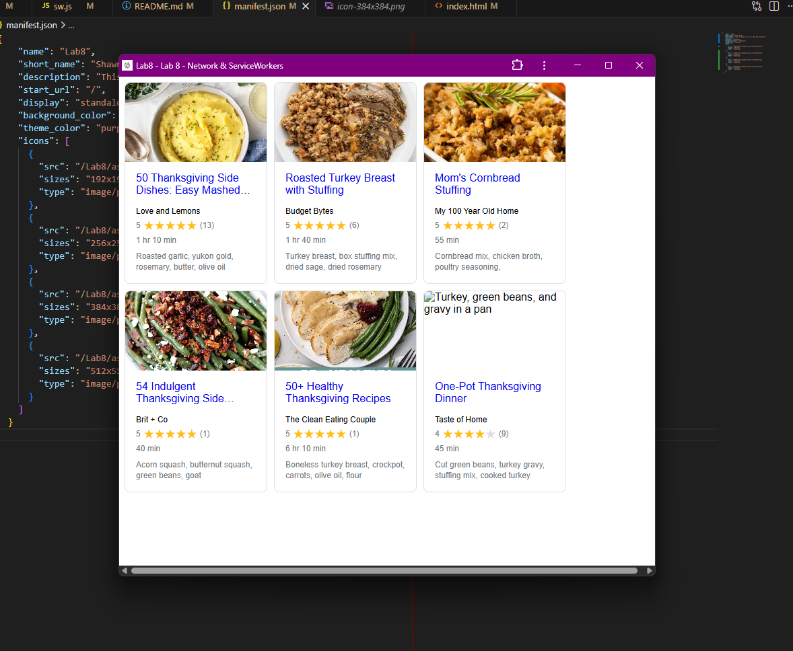

# Lab8-Starter

## Lab partners:
Shawn Wang

## Github Pages URL:

## How are graceful degradation and service workers related?
Graceful degradation starts off by assuming that everyone is working with the
best possible technology available to them. This includes many subcomponents
like display colors, display size, available sounds, but importantly also 
network connection. We would do well not to assume that everyone has a perfectly
stable connection all of the time (I certainly don't while living in the dorms)
and as such use graceful degradation to make our webpages more resilient. 
Service workers serve as the graceful degradation solutions to networks being 
patchy. They allow systems to stay up even while the network has been cut and
increase performance by loading things in the back end, making our webpages more
accessible to those less fortunate.

